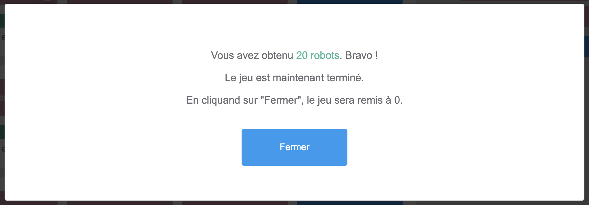

# Robot Factory
App made with React, Typescript, Styled-components and Storybook.
It's a mini-game that makes your robots mine Foo, and Bar to build Foobar in order
to buy more robots.

## Menu
[Requirement](#requirement)

[Quick Start](#quick-start)

[Note](#note)

[All commands](#all-commands)


## Requirement

````
Le but est de coder une chaîne de production de foobar.
La production n'a pas besoin d'être optimale, seulement fonctionnelle.

Le jeu commence avec 2 robots, mais on souhaite ensuite accélérer la production
pour prendre rapidement le contrôle du marché des foobar.

Les robots sont chacun capables d'effectuer plusieurs actions :
- Se déplacer pour changer d'activité : occupe le robot pendant 5 secondes.
- Miner du foo : occupe le robot pendant 1 seconde.
- Miner du bar : occupe le robot pendant un temps aléatoire compris entre 0.5 et 2 secondes.
- Assembler un foobar à partir d'un foo et d'un bar : occupe le robot pendant 2 secondes.
  L'opération a 60% de chances de succès ; en cas d'échec le bar peut être réutilisé, le foo est perdu.
- Acheter un nouveau robot pour 3 foobar et 6 foo , 0s.

Le jeu s'arrête quand on a 20 robots.
````

## Quick Start

### Before installing

If you are using [avn](https://www.npmjs.com/package/avn), there is a `node-version` file that
will automatically set your node version to `16.13.0`.

If not, make sure you're using a `node version >= 16`.


### Install dependencies

---

You can use either `yarn` or `npm` to install app dependencies by using
- `yarn install`

or

- `npm install`

---


### Start the App

---

- `yarn start`

or

- `npm start`

By default, app will be accessible on port `4000`.
You can change port by using an environment variable in the command line, such as `PORT=4010 npm|yarn start`

---

### Start the storybook

---

- `yarn storybook`

or

- `npm run storybook`

By default, storybook will be accessible on port `6006`.

---

See [All commands](#all-commands) for more information.

## Note

### Technical choices

I choose to create a front-end application using [React](https://fr.reactjs.org/) and [Typescript](https://www.typescriptlang.org/).
With React, I used internal (useContext, useState, useEffect,...), and custom hooks (useTimer, useActivity,...).
To create components, I choose to use [Styled-components](https://styled-components.com/) and to display
them in a [Storybook](https://storybook.js.org/) page.

All components are tested using [Jest](https://jestjs.io/fr/)
and [React-testing-library](https://testing-library.com/docs/react-testing-library/intro/).
The coverage rate is 100%.

[Prettier](https://prettier.io/) and [Eslint](https://eslint.org/) are used in the project to respect some code quality rules.

All the rules matching [requirement](#requirement) (activity duration, numbers of robot to win, costs for foobar and robots, ...) are set in `src/utils/settings` file.
To change the game rules, this file can be edited.

### My solution

I decided to solve the [requirement](#requirement) problem with a simple UI.
A robot is represented in a line, in a card that contains action buttons.


When the game starts, the robot is not doing any activity.

When the user clicks on an enable button ("Miner Foo" or "Miner Bar"), the robot starts this activity, the loader
is filled until the activity time is done.

The current activity is represented by a robot icon on the activity button.

For example, in this image, the robot is mining Bar :


When the robot is mining a Foo or mining a Bar, the activity starts again automatically after it ended.


Building a Foobar and buying a robot require resources (1 Foo & 1 Bar for a Foobar, 6 Foo and 3 Foobar for a Robot).
The user can't click on those buttons until he has enough resources


When the building a Foobar time is over, the robot has either succeeded or failed.
A message is displayed to inform the user. Then, if there is still enough resources, the robot re-tries to build a Foobar.

If user click on a button while the robot is currently doing an activity, the robot will be "moving", it takes
5 seconds, and it will start the new activity after.


When a new robot is bought, a new line of Robot is added to the page.

All resources and robots that the user has are displayed on the right side of the screen.


When the user obtains 20 robots, a modal pops up to inform them that the game is over.



The activity duration is made with a hook that sets a timer and count down until 0.
I used [setTimeout](https://developer.mozilla.org/fr/docs/Web/API/setTimeout) to handle time and durations.

Another hook is used to set the current activity, start the timer (with the timer hook), and set the information about
the current activity. Once the activity duration is over, it sets the information about the results (success, failure) and starts
again if needed (when mining foo or bar or building a foobar).
This hook also handle the robot shift, and start the next activity when the robot has stopped moving from an activity to another.

All the resources totals are stocked in a React Context.

### Possible improvements

- For timing reason I decided not to make this application responsive. The best screen width to enjoy
  this app is >= 1350 px. (Desktop)
- For timing reason I decided to make more efforts on the technical side than on the design.
- I chose to keep record of the resources using React `useContext` hook, but it would be better to
  use cache so the game will not be reset on browser refresh.
- I chose to use an architecture with `components`, `containers` and `pages`, and I wanted the components to be as
  stateless and logicless as possible to be usable in different context or project (for example if we wanted to create a reusable design system from them)
  but this strategy and architecture made me create `variables` files in `hooks` container to determine some text and icon to display, and I figured
  it is not the best way to split components responsibilities. So, if I had to improve this code, I'll provide more responsibility to small components
  and focus only on the programmatic logic in hooks.
- I did not use `settings` variables in test, but if we wanted the app to be more flexible, we might prefer to have test pass even when we change the settings.


### Architecture and best practices

#### Architecture

The app is built with 1 principal folders : `src`.

* src
    * `components` contains all the components needed for the App. In this project, a "component" is a React component that does not have
      any logic in it. A component can work in different use cases, it does not need a specific context to be used. The provided props are the
      only context they need to be functional.
    * `containers` contains all the containers needed for the App. In this project, a "container" is a React component that needs context, logic,
      state,... For example, a container can not be used in another project context.
    * `contexts` contains all the contexts needed for the project.
    * `hooks` contains all the custom hooks used in the project.
    * `pages` contains all pages needed for the App. A page match a route, in this project there is only one route ('/'), so there is only one page (Home).
    * `style` contains the style variable and the global style of the application.
    * `test-utils` contains mock or set up files to be used in tests.
    * `utils` contains settings and common enum.

Those folders contain sub-folders :
- `tests` contains the tests made with `Jest` and `React-testing-library`.
- `stories` contains the storybook stories (only for components).

#### Best practices

This project respect some naming rules for the files :
- A `component` file is named `[ComponentName].component.tsx`
- A `container` file is named `[ContainerName].container.tsx`
- A `page` file is named `[PageName].page.tsx`
- A `hook` file is named `hookName.hook.tsx`
- A component|container|page style file is named `[componentName].style.tsx`
- A component|container|page utils file is named `[componentName].utils.tsx`
- A component|container|page story file is named `[componentName].story.tsx` and be placed in a `stories` file
- A test is named `[componentName].[utils?].test.tsx`

Each container | component have an `index.ts` file to make imports easier.

The graphic assets (colors, spaces, ...) are referenced in the `styles/variables.ts` file.

## All commands

### Start

---

- `start` : use `per-env` to call either `start:development` or `start:production` depending on the variable `NODE_ENV`. By default
  this variable is set to `development`.
- `start:development`: start webpack dev server with hot reload.
- `start:production`: start webpack server production mode.


---

### Build

---

- `build`: build bundle using `webpack` in production mode.

---

### Test

---

- `test` : run all tests
- `test:update`: run all tests update snapshots
- `cover`: run all tests and check coverage thresholds

---

### Lint & prettier

---

- `lint` : use `eslint` to check linting
- `lint:fix`: use `eslint` to fix linting issues
- `prettier:fix` : use `prettier` to beautify code

---

### Storybook

---

- `storybook` : start `storybook` on port 6006
- `storybook:build` : build `storybook` static assets

---
